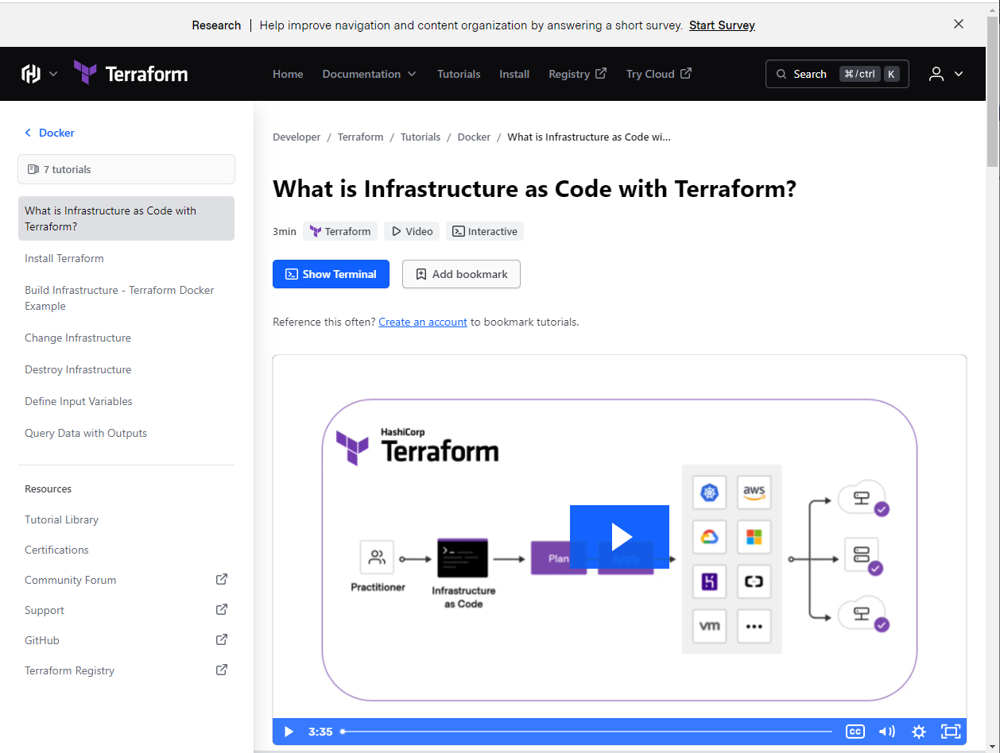
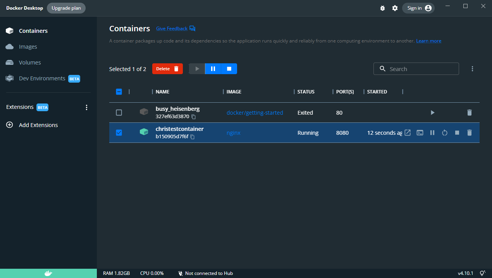

# Learning Terraform

## Docker + Terraform

[Docker Tutorial](https://developer.hashicorp.com/terraform/tutorials/docker-get-started/infrastructure-as-code)

Learning from offical terraform kb

Using terraform apply -var "container_name=<container>" to deploy terraform config to local docker

Checking localhost at port 8080 to see web server running
